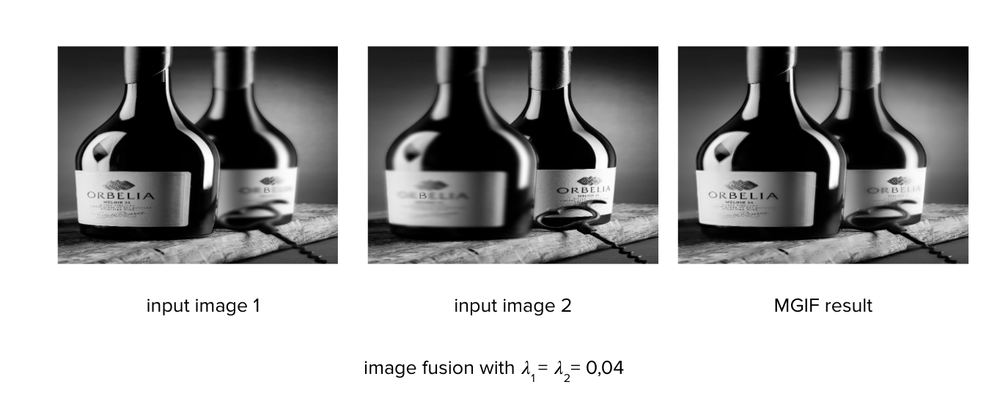

# Multichannel-guided-image-filter and GIF

## (Chang Liu, Xiaolin Wu, Xiao Shu)

##### MGIF processing

##### Introduction about my GIF and MGIF  
[Intro](https://docs.google.com/presentation/d/1GfCUBeYe1Zkqw6nWQ_wM4fQrYAnd9Pb7OA9UOM63q-k/edit#slide=id.ga9143ea4bc_0_0)

##### Setup  
[multi.py](./multi.py) is set up about MFGIF   
[gif.py](./gif.py) is set up about GIF

